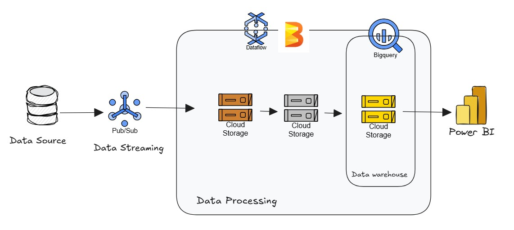

# 🏥 Real-Time Patient Vital Signs ETL Pipeline (GCP)

Este proyecto implementa un pipeline **ETL en streaming** para el monitoreo en tiempo real de signos vitales de pacientes utilizando Google Cloud Platform (GCP). La arquitectura sigue el enfoque **Bronze → Silver → Gold**, procesando datos desde su ingestión hasta su disponibilización analítica para dashboards de monitoreo.

---

## 📌 Arquitectura General

El flujo completo incluye:

1. **Simulador de datos** que genera signos vitales de pacientes.
2. **Google Pub/Sub** para ingestión en streaming.
3. **Dataflow + Apache Beam** para procesamiento:
   - **Bronze** → datos crudos en Cloud Storage  
   - **Silver** → datos limpios y enriquecidos  
   - **Gold** → agregaciones por paciente
4. **BigQuery** como data warehouse.
5. **Power BI** para visualización en tiempo real.

---

##  Simulador de Signos Vitales

El proyecto incluye un simulador en Python que genera los siguientes campos:

- `patient_id`
- `timestamp`
- `heart_rate`
- `spo2`
- `temperature`
- `bp_systolic`
- `bp_diastolic`

El simulador inyecta errores como:
- Campos faltantes  
- Valores fuera de rango  
- Valores negativos  

Publica los datos en formato JSON a un **topic Pub/Sub**.

